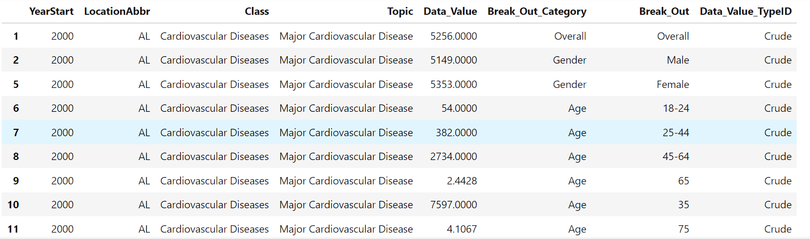
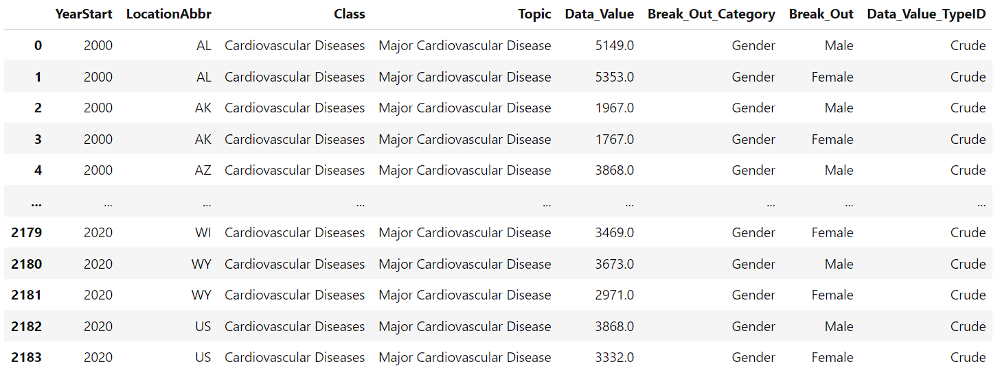
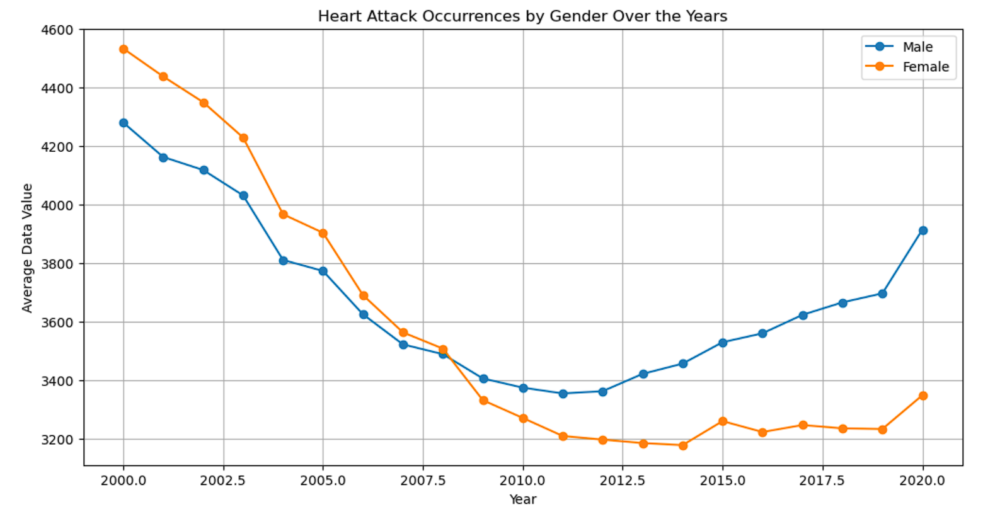
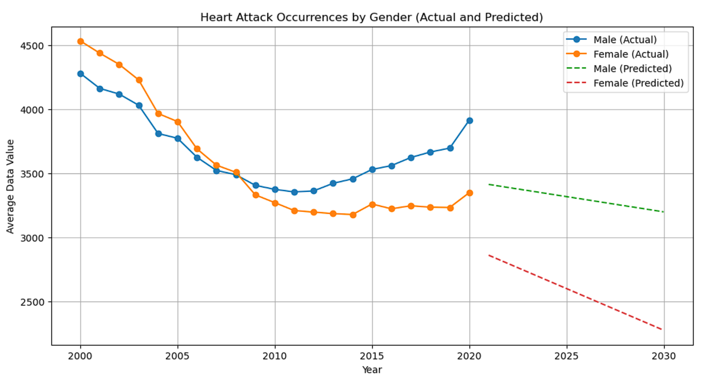
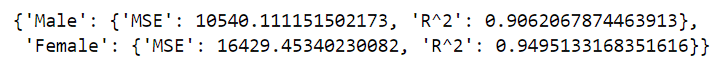
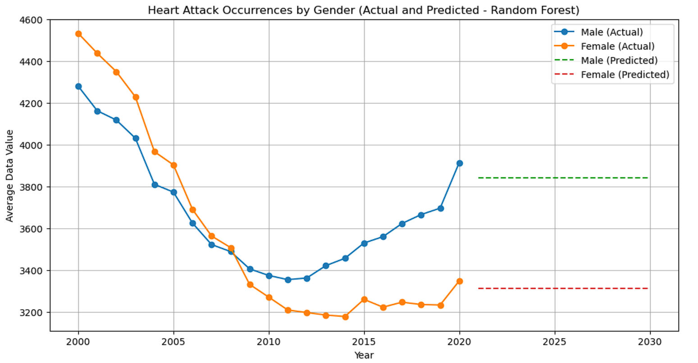

HEART DISEASE
-----------------------------------------------------------------------------------------------------
Someone dies from Heart Disease every 33 seconds, every 1 in 5 deaths is realted to Heart Disease. 
This is a huge number! From the high number of deaths people have changed diets, exercise routines and 
even monitor their metrics through a watch. Our project is about Heart Disease predciting the future of 
this disease and what the figure will be in the future. Our Linear Regression Model should show the 
characteristics of a higher chances of developing this disease. 

Our project starts off with EDA. We imported our csv file, "Disease_Data.csv" from [(DATA.GOV) ](https://catalog.data.gov/dataset/rates-and-trends-in-hypertension-related-cardiovascular-disease-mortality-among-us-ad-2000-2fdf2)  
we broke this down to Race, Age, General and Overall. Next the is seeing the years of our dataset which 
starts in 2000 to 2020. After cleaning the data our final DataFrame is pictured below:

After the DataFrame cleaning process, we moved on to breaking up the columns by our topics; Age, Gender, 
Race, and Overall. We decided to breakdown the DataDrame into topics due to two reasons: 
1) the original file was large in size 
2) divide the project across the team.
For example, our Gender DataFrame is shown below:

The next section of work was graphing our DataFrame and beginning our Linear regression Model. The first 
graph is showing a trend of heart attack occurences by gender over the years. We the plot we show both Male
and Female, against the Year and Average Data Value. 

The next section we will discuss the results across the topics staying of with Gender. The first figure is 
a line graph displaying our Linear regression Model results for Gender. The first figure, “Heart Attack 
Occurrences by Gender Over the Year” shows a trend of heart attack occurrences by gender over the years. The 
plot shows both males and females trended down from 2000-2010, however, the trend has changed. Since 2010, 
there has been an increase in occurrences for both genders. There is a difference though in the trend from 
2000-2010 and 2010 to now – in the first trend females had more occurrences than males.  Now, males have 
more occurrences than females.

The interesting part of the this model is that Heart Disease will decline in the next 10 years, with females
being predicted to have the lower drop in Heart Disease. While you are reading maybe let us know what you think
the reason is for the drop?

We used a RandomForest Model for the next section of code, our data is the index of the year and our labels 
is the gender. We run a Train_Test_Split for both Male and Female, using a random_state of 42 and a test_size
of 0.2. We call RandomForestRegressor with n_estimator = 100, and random_state = 42, .fit() the data, run a 
predict. We have a metric for our R^2 and mean squared error. Picture below.

After seeing our metrics of the data, we use np.arange for the next ten years, run our predict models and then
plot our findings. 

Here we see the predict model is showing us that things will plateau, and no change will happen for both Male 
Female. Interesting! 

Our next task was calculating the number of occurences by state per year. Here we count the number of occurences 
by the states and then we graph these values. We used a histogram to show our data.

This project was a colaborration of our team to bring one of our members work to life. We all took different roles
and worked to build this Machine Learning Model to show case our findings. We hope you stay healthy and enjoy our
Machine Learning Algorithim. 
